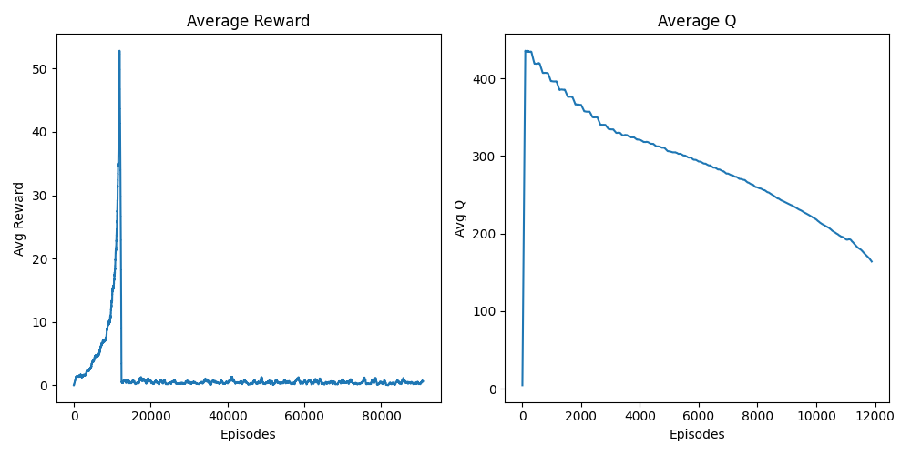
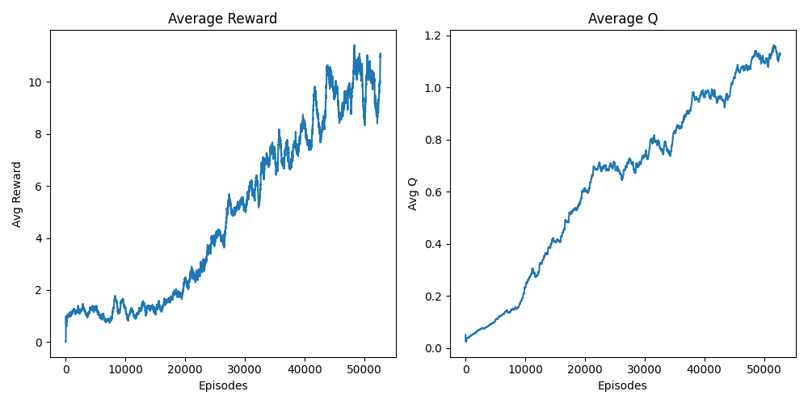
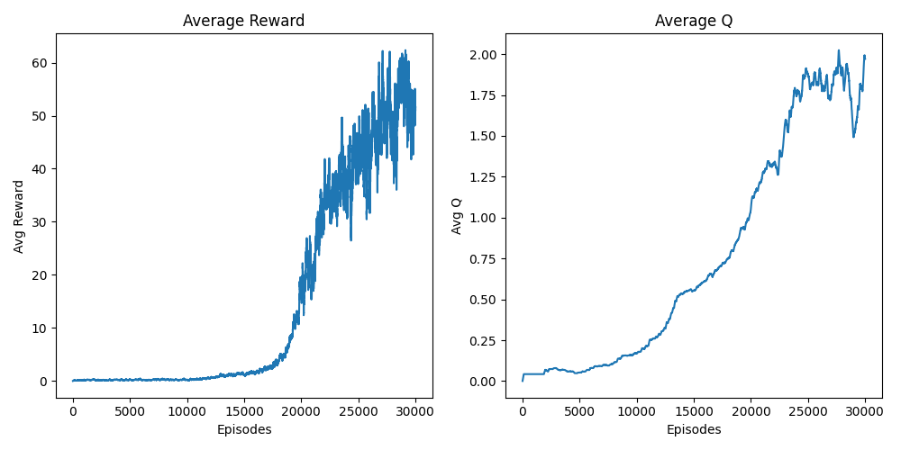
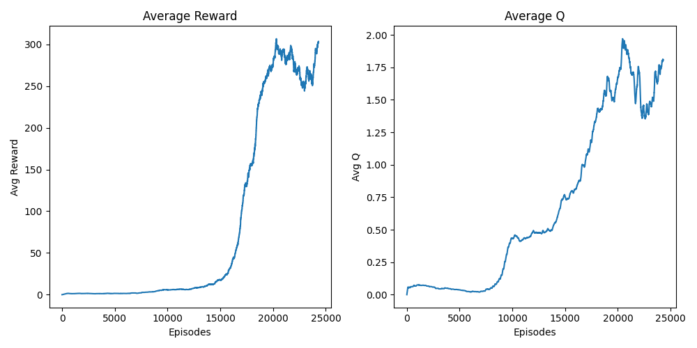
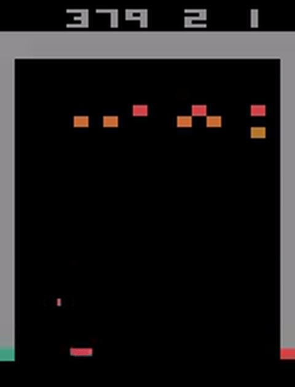
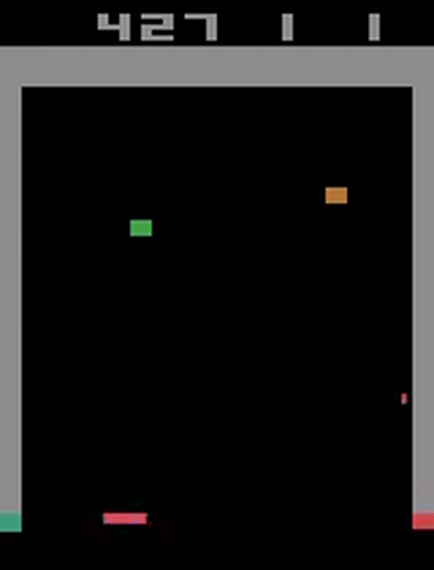
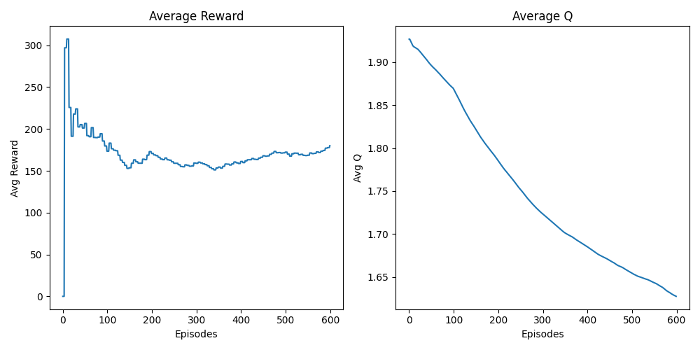
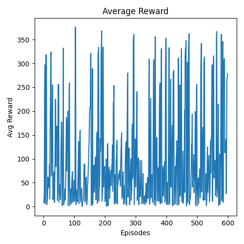
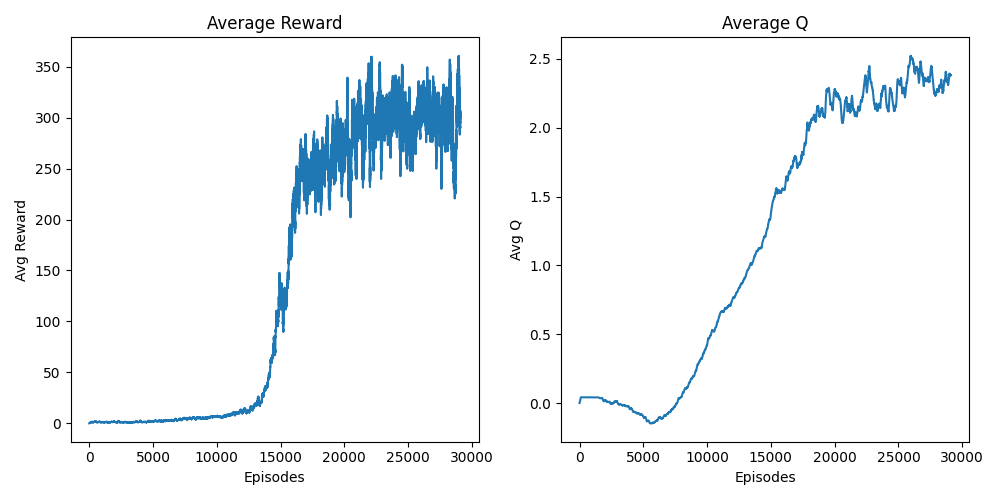
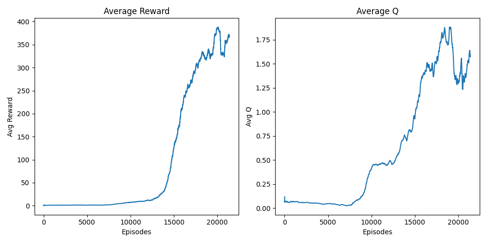

# Deep Q-Network for Atari Breakout

## Overview

This project implements and compares multiple Deep Q-Network (DQN) variants for playing Atari Breakout, achieving a best score of **843 points** with an average evaluation score of **460 points**.


### Implemented Algorithms
- Vanilla DQN (Mnih et al., 2013)
- Double DQN (van Hasselt et al., 2015)
- Dueling DQN (Wang et al., 2015)
- Distributional DQN (C51) (Bellemare et al., 2017)
- Noisy Networks (Fortunato et al., 2017)

## Project Structure

```
.
├── agent/
│   ├── agent.py          # Agent implementation
│   ├── env.py            # Environment wrapper
│   ├── memory.py         # Replay buffer
│   └── model.py          # Neural network architectures
├── model/
│   └── [run_name]/	      # There is one folder per run
│       ├── checkpoints/  # Saved model weights
│       ├── config.yaml   # Run configuration
│       ├── logs/         # Training and evaluation metrics
│       └── videos/       # Evaluation recordings
├── config.yaml           # Hyperparameters
├── main.py              # Training script
├── test.py              # Evaluation script called by the main script
├── replay.py            # Will load a model and evaluate it / save best videos
└── visualize.py         # Plotting utilities
```

## Methodology

### Hyperparameter Decisions

Episodic Life (`episodic_life=True`)
Sends end-of-episode signals when losing a life without resetting the environment. This approach teaches the agent that losing lives is detrimental. No resetting the env prevents the agent from only experiencing initial game states.

Reward Clipping (`clip_rewards=True`)
While unclipped rewards might theoretically help the agent learn tunneling strategies, in practice they destabilize training by disrupting gradient flow and Q-value estimation. Clipped rewards produce faster and stable convergence.

Frame Skip (`frame_skip=4`)
Tested values: 2, 3, and 4. While frame skip of 4 occasionally causes the agent to miss the ball by small margins, lower values converge significantly slower without clear performance benefits. Frame skip of 4 was retained.

Replay Memory (`buffer_size=300k`)
Limited by hardware constraints. Disk-based replay using TorchRL proved too slow for practical use.

Action Space Randomization (`noop_max=30`)
Up to 30 no-op actions at episode start reduce determinism.

Exploration Strategy
Epsilon-greedy exploration outperformed Noisy Networks, providing better control and reducing action looping behaviors as explained at the end of this README.

## Experimental Results

All models were trained for approximately 7 hours (a whole night) per run due to hardware limitations.

### Vanilla DQN (Baseline)

The standard DQN implementation served as our baseline, achieving stable learning and reaching an average reward of 280 by 30k episodes.

### Distributional DQN (C51)

According to the Rainbow paper (Hessel et al., 2018), distributional learning provides significant gains on Breakout (as you can see on the last column of the graphics. When removing C51, performance drops so we can think that adding it increase performance).


However, our implementation faced stability challenges.

**Initial Run:**


Training progressed well until episode 10k, where gradient explosion caused NaN values in Q-predictions.

**Stabilized Run:**


After implementing gradient clipping and reward normalization, training stabilized but convergence became extremely slow (average reward of 10 at 50k episodes vs. 280 for vanilla DQN at 30k).

**Best Configuration:**


Despite extensive hyperparameter tuning (atom counts, value ranges), C51 underperformed compared to the simpler DQN architectures. Given the complexity of the paper, our implementation might be not exact. Also with our limited computational budget, we proceeded to evaluate simpler improvements.

### Double Dueling DQN (D3QN)

Based on Rainbow Double and Dueling modifications provide some gains on Breakout. So we combined both techniques.

**Initial Results:**


Promising early results with healthy Q-value growth and increasing average rewards.

**Optimized Configuration:**


High average rewards were achieved, but evaluation videos revealed a troublesome issue: action looping.

#### The Looping Problem



The agent became stuck in repetitive action patterns jsute after the end of the first wall. Occasionally, it would reach the second wall but immediately lose all remaining lives:



Hypothesis:
- Despite no-op randomization, only 30 unique initial states exist. As epsilon decays, the agent exploits learned patterns that lead to loops.
- The agent observes the score pixels (through the image), creating different state representations after breaking through walls. This causes policy degradation in novel high-score states.

### Solutions Explored

#### 1. Fine-Tuning on End-Game States

Pre-fill replay buffer with high-score experiences (score > 360) and maintain a ratio of full games to end-game states during training.



Outcome: Catastrophic forgetting occurred despite attempts to balance replay ratios, maintain small epsilon values, and limit training episodes. Q-values and rewards both declined. Rewards were really unstable:



#### 2. Penalty-Based Shaping

We tried adding two penalties:

Life Loss Penalty (-1 reward): Teach the agent to preserve lives, potentially allowing it to survive longer after breaking through the first wall.

Loop Detection Penalty (-1 reward): Applied when no bricks are hit for 200 consecutive steps to discourage repetitive behaviors.



Outcome: Best configuration using both penalties achieved an average evaluation score of 385 (10-game average), better than the standard D3QN. The initial Q-value drop reflects early life losses before the agent learns survival strategies.

#### 3. Adaptive Exploration (Best Solution)

Dynamically adjust epsilon based on agent behavior:
- Increase epsilon by 0.005 every 100 steps without brick contact
- Reset epsilon when bricks are hit



It gaves the best results with and average reward of **460 points**. So it means it achieves to pass the first wall. When replaying the model we achieved a score of 843 points.

## Future Work

- Performance curves indicate room for improvement with additional compute time.
- Better hyperparameter search for C51.
- PPO-based approaches have achieved 804 average reward ([reference](https://huggingface.co/cleanrl/Breakout-v5-cleanba_ppo_envpool_impala_atari_wrapper-seed2)).
- Larger replay buffers and longer training runs would benefit all approaches.

## References

- Mnih et al. (2013). Playing Atari with Deep Reinforcement Learning.
- van Hasselt et al. (2015). Deep Reinforcement Learning with Double Q-learning.
- Wang et al. (2015). Dueling Network Architectures for Deep Reinforcement Learning.
- Bellemare et al. (2017). A Distributional Perspective on Reinforcement Learning.
- Hessel et al. (2017). Rainbow: Combining Improvements in Deep Reinforcement Learning.
- Fortunato et al. (2017). Noisy Networks for Exploration.
- Schaul et al. (2015). Prioritized Experience Replay.
- De La Fuente et al. (2024). A Comparative Study of Deep Reinforcement Learning Models: DQN vs PPO vs A2C.

## Installation & Usage

```bash
# Install dependencies
poetry install

# Train model
python main.py

# Evaluate trained model (you need to change the path of the model that will be loaded inside the script)
python replay.py

# Visualize metrics
python visualize.py
```

See `config.yaml` for all available hyperparameters.
